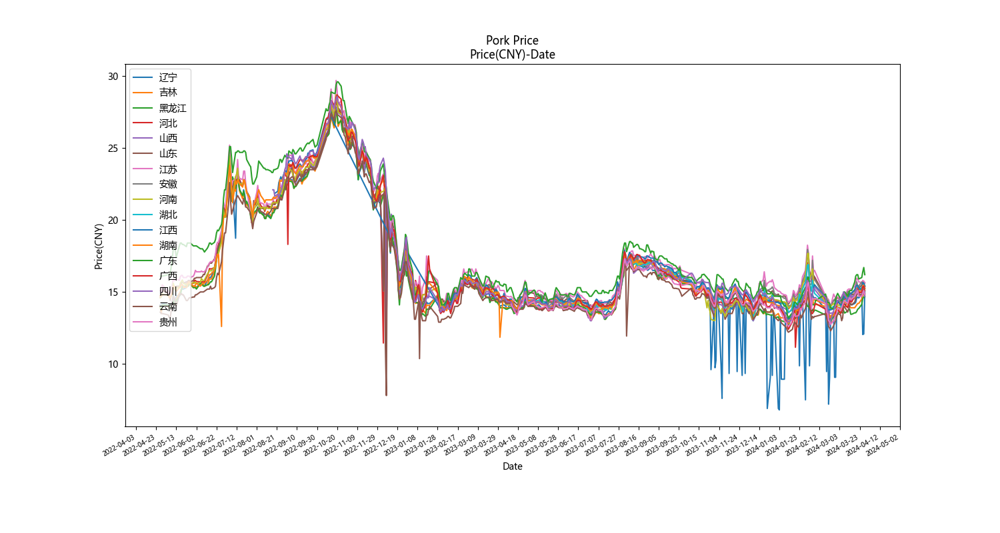

# 猪肉市场价格数据集

爬取了2022-04-27至2024-03-28中的477天的各地猪肉价格数据。

### 代码：

1. [get_index.py](get_index.py): 从猪肉主页面获取所有文章日期、标题和链接。
2. [get_data_from_index.py](get_data_from_index.py): 从所有文章标题中筛选【卓创资讯】的国内生猪重点市场9点半价格早报数据，并获取表格内容。
3. [format_table_from_data.py](format_table_from_data.py): 从表格内容中提取当日各地的猪肉价格。这里的计算方式是统计`标准体重生猪`/`140公斤以内`字段出现的数值的平均值。
4. [plot_prices.py](plot_prices.py): 绘制各地猪肉价格变化曲线。

### 数据集：

1. [index.json](index.json): 猪肉价格相关的所有文章日期、标题和链接。
2. [qg_data.json](qg_data.json): 【卓创资讯】的国内生猪重点市场9点半价格早报表格数据。
3. [prices.json](prices.json): 当日各地的猪肉价格(元/斤)。

数据来源：[中国畜牧业协会](https://www.caaa.cn/) | 卓创资讯
